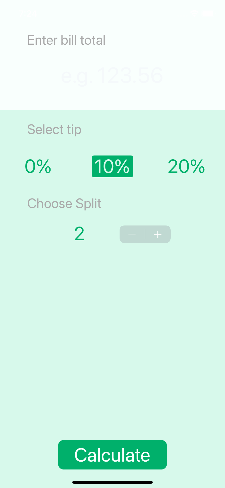

Tipsy, Developed by Sebastian Güiza, using Xcode and App Brewery

#  *** Tipsy ***

Tipsy, lets you calculate the percentage of the tips that you can earn

What I learned in this module was:

* How to create multi-screen apps with animated navigation.
* Optional binding, optional chaining and the nil coalescing operator.
* How to create classes and difference between classes and structs. 
* Pass by value vs. pass by reference. 
* Formatting Strings. 
* Color literals.

Everybody who wants to use this application, ¡¡¡ 

# Enjoy it !!!

